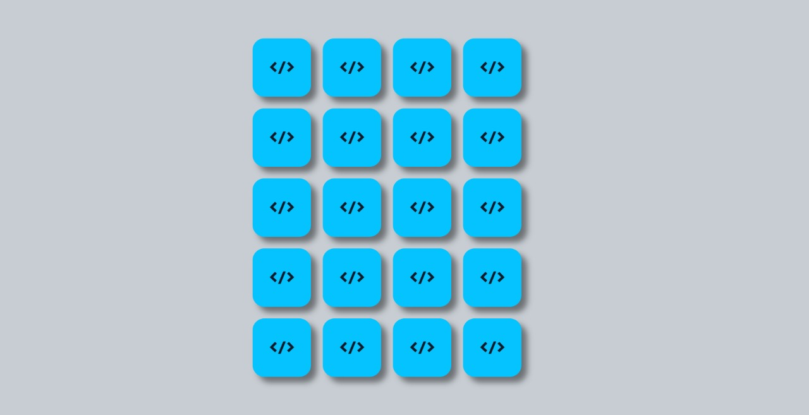

# 🎮 Jogo da Memória
Bem-vindo ao Jogo da Memória, um projeto desenvolvido utilizando HTML, CSS, JavaScript e React. O objetivo é simples e divertido: encontre todos os pares de cartas iguais no menor tempo possível!

## 🚀 Funcionalidades
✅ Interface simples e intuitiva

✅ Animações de flip nas cartas

✅ Tela de vitória ao completar o jogo

✅ Totalmente responsivo (adapta-se a diferentes tamanhos de tela)

✅ Reinício do jogo a qualquer momento

## 🖥️ Tecnologias Utilizadas
HTML5

CSS3

JavaScript 

React

Fonte: Google Fonts - Righteous

## 🎯 Como Jogar
Clique nas cartas para revelá-las.

Encontre os pares de cartas com o mesmo símbolo.

Complete todos os pares para vencer.

Clique em "Reiniciar" para começar novamente.

## 🔧 Como Rodar Localmente
Clone o repositório:

bash
Copiar código
git clone https://github.com/JoaoGabriel04/Jogo-da-Mem-ria.git
Acesse a pasta do projeto:

bash
Copiar código
npm install
npm start

## 📱 Responsividade
O jogo foi projetado para funcionar bem em computadores, tablets e smartphones.

## 📝 Melhorias Futuras
⏱️ Adicionar contador de tempo ou de tentativas

🔊 Efeitos sonoros para ações e vitória

🏆 Sistema de pontuação ou ranking

🎨 Temas variados para as cartas

## 📸 Preview do Jogo

## 💡 Créditos
Desenvolvido por João Gabriel Castro Silva 🚀
